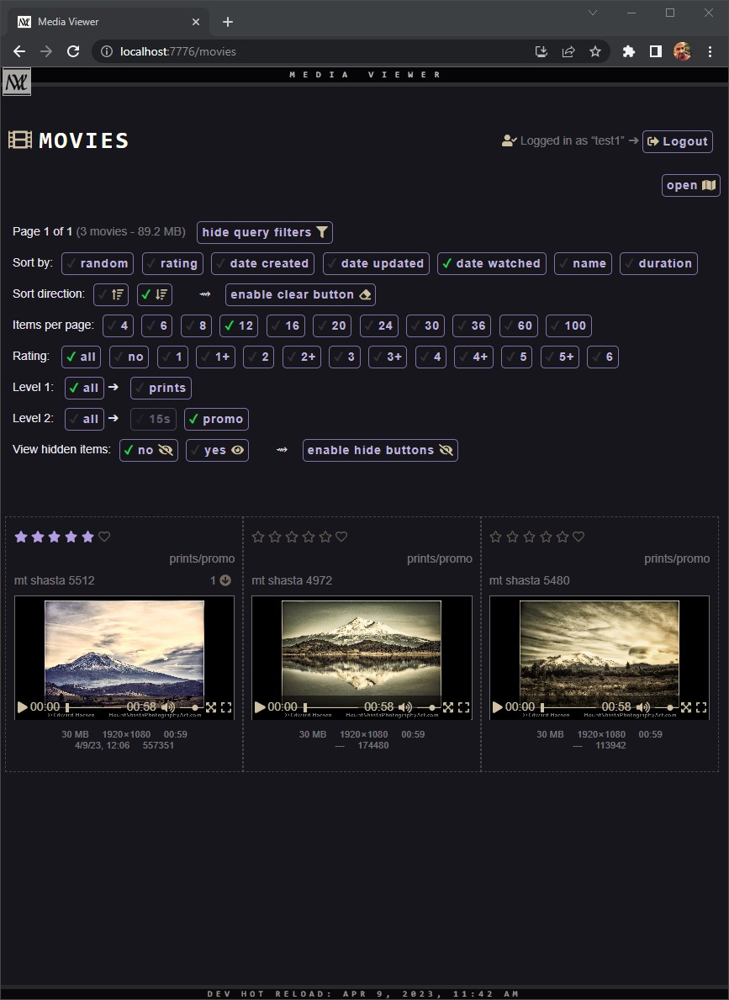

# media-viewer-webapp

This is a project to be run locally on a laptop or LAN network as a local media (movie) server with a webapp interface.

This is intended to be a movie viewer as well as an audio player, but current implementation only has the movie viewer.

Features of the movie viewer:
- sort by:
  - random
  - rating
  - date created
  - date updated
  - date watched
  - name
  - duration
- sort direction:
  - ascending
  - descending
- items per page:
  - 4, 6, 8, 12, 16, 20, 24, 30, 26, 60 or 100
- rating:
  - all, no, 1, 1+, 2, 2+, 3, 3+, 4, 4+, 5, 5+ or 6 stars
- level1:
  - all, or one of the available detected level1 folders
- level2:
  - all, or one of the available detected level2 folders
- duration
  - all, or selected range in increments of 5 minutes
- View hidden items
  - no/yes view all movies that are marked for deletion and hidden from main browse functionality

Movies are suggested and expected to be organized in a folder structure with two levels:
```
movies/[level1-A]/[level2-A]/[movie1]
movies/[level1-A]/[level2-A]/[movie2]
movies/[level1-B]/[level2-B]/[movie3]
movies/[level1-B]/[level2-B]/[movie4]
```

The maximum number of movies supported is 8192.

The folder levels are detected on import of the movie meta-data (see below).

Movies can be viewed either in three different modes:
- inline within the movie list
- in maximum browser-width mode
- in full-screen mode

Movies can be marked as "hidden". While viewing the "hidden" items they can be deleted from the DB. The webpage displays a list of delete commands that can be copied to a batch file to easily remove the deleted movies from the file system as well.

## Linux Setup

### Install nodejs

- Install [nvm](https://github.com/nvm-sh/nvm), the NodeJs Version Manager.
- Use `nvm` to install NodeJs V9.0.0 or later.
    (I have this project running on an old eeepc netbook with [Linux Lite 3.8](https://osdn.net/projects/linuxlite/storage/3.8/), the last 32bit version. After much trial and error I installed Node V9.0.0 because that is the latest major version for which binaries are available)

  ```bash
  # install nodejs V9
  $ nvm install v9.0.0
  ```

### Get project code repository

- Clone or download this media-viewer-webapp repo.
    All required dependables are included. You only need NodeJs (with `npm`, the NodeJs Package Manager) to pre-exist on your system.

### Install node modules

```bash
# cd to media-viewer-webapp repo directory
$ cd [path/to/media-viewer-webapp]
# install node_modules in server directory
$ cd server
$ npm install
# install node_modules in client directory
$ cd ../client
$ npm install
```

### Create symlink to media folder

```bash
# create the client/public/media directory if it does not exist already
$ cd [path/to/media-viewer-webapp]
$ cd client/public
$ mkdir media
# create a symlink from the movies folder on your media drive to the client/public/movies folder
$ cd media
$ ln -s [path/to/movies-folder-or-drive] movies
```

### Setup test users (optional)

```bash
# cd to media-viewer-webapp repo directory
$ cd [path/to/media-viewer-webapp]
$ cd server
# copy dummy data as a starting point
# users: test1 and test2. Password equals username
$ npm run setup:dev
```

### Register media owner

Register a user through the webapp (see "Development Usage" below how to start server and client, and how to access the webapp) - this will become the owner of the media data.

### Set OWNER_ID

Inspect the `server/data-setup/users.db` file and note the "_id" value (a 16-character string) for the registered user and export this as OWNER_ID

```bash
# set environment value for OWNER_ID
$ export OWNER_ID=[value-from-user.db]
```

### Import the movie media metadata

```bash
# cd to media-viewer-webapp repo directory
$ cd [path/to/media-viewer-webapp]
$ cd server
# scan the movie folder, 
# get media asset metadata
# and initialize the movies DB for OWNER_ID
$ node init.js
```

### Set the ENV variables

```bash
# cd to media-viewer-webapp repo directory
$ cd [path/to/media-viewer-webapp]
$ cd client
# set environment variables (build time and levels names)
$ npm run set:env
```

## Development Usage

**In Git Bash window #1 - run server**:

```bash
# cd to media-viewer-webapp repo directory
$ cd [path/to/media-viewer-webapp]
$ cd server
# start the server
$ npm run dev
```

You should see a generic Feathers page at <http://localhost:3333/>.

**In Git Bash window #2 - run client**:

```bash
# cd to media-viewer-webapp repo directory
$ cd [path/to/media-viewer-webapp]
$ cd client
# start the server (hot-reload enabled)
$ npm run dev
```

You can view the client app at <http://localhost:7776/> (local) or at a LAN address (LAN network) - the build output will show the LAN IP address to use.

For LAN access you may need to change your (Linux) firewall settings to allow incoming requests on ports 7776 and 3333.

## "Production" Usage

This app is meant for local use, it's not designed to be able to handle a large user base. Besides, content is stored in simple clear text format only.

This app is meant to run on your LAN on one PC/laptop and you can then access the browser interface from any of your other devices when on the same network.

When used like this, you should no longer run the server and client in "development" mode (which uses a virtual build and hot-reload logic).

Instead of `npm run dev` you should run in "production" mode and build the client code to a build directory which then can be served as static files by a simple webserver:

```bash
# in the command window for the client
$ cd [path/to/media-viewer-webapp]
$ cd client
# build the webapp, available later to serve from the build directory
$ npm run build
```

but make sure to symlink the media folder to the new build directory

```bash
# in the command windows for client
$ cd [path/to/media-viewer-webapp]
$ cd client/build
$ mkdir media
$ cd media
$ ln -s [path/to/movies-folder-or-drive] movies
```

and start both server and client with

```bash
# in the command window for client
$ npm start
```

```bash
# in the command window for server
$ npm start
```

### Single Page Application (SPA) server

In order to be able to reload the movies page in proper SPA fashion, a proxy needs to be defined in the "serve:prod" script in the client's `package.json` file, otherwise the server will return a 404 'file-not-found' error on attempted reload.

This proxy requires your local IP to be hardcoded.

Assuming the local IP is `192.168.0.2`, the existing script

```json
"serve:prod": "npx http-server ./dist -p 7777"
```

should be replaced by

```json
"serve:prod": "npx http-server ./dist -p 7777 -proxy http://192.168.0.2:7777?"
```

(obviously this means that your PC/laptop needs to be setup with a static IP address)

For LAN access you may need to change your (Linux) firewall settings to allow incoming requests on ports 7777 and 3333.

## Screenshots

Below are some screenshots of the movie viewer with a few sample movies.

### Screenshot - All movies, sorted by date watched


### Screenshot - All movies with selected rating range


### Screenshot - All movies in selected sub-level



### Screenshot - All unrated movies in selected sub-level


### Screenshot - Legend of movie player hot spots and hot keys


### Screenshot - Movie player and its controls

- top left corner: 
  - speed controls
  - forward/backward controls
- top right corner:
  - set rating
  - set start screen flag
  - set marker(s)
- bottom:
  - display running and remaining time
  - display play-head and video buffer
  - allow marker removal (drag marker up)
  - audio volume control
  - button to enter/exit fullscreen mode

Video controls will move out of sight when movie is not in focus (when mouse is moved outside the viewing area).

